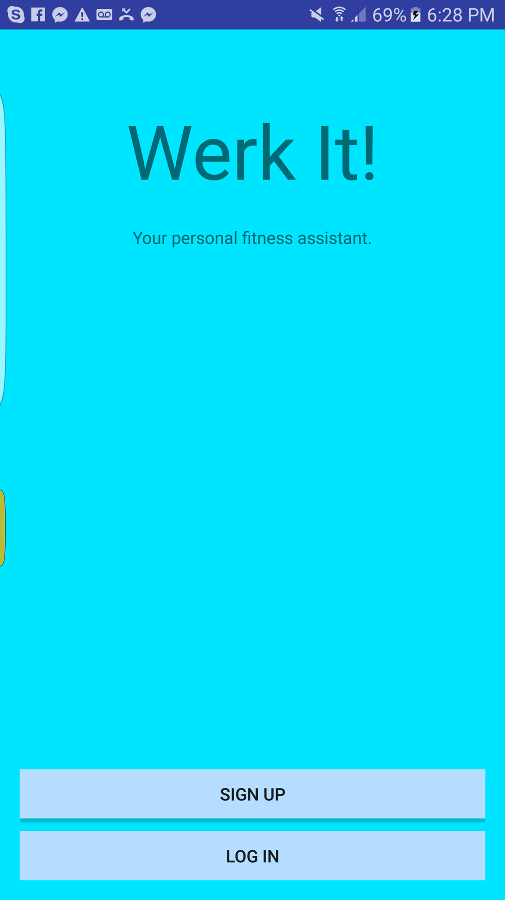
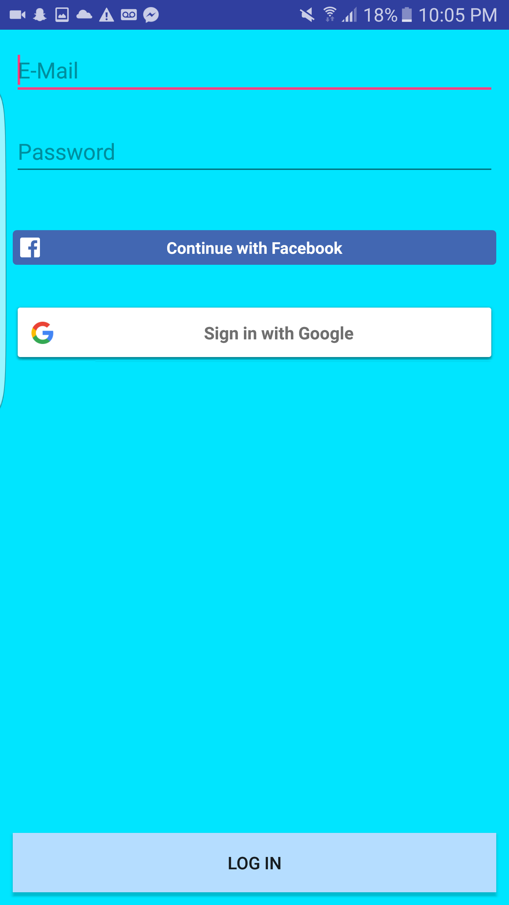
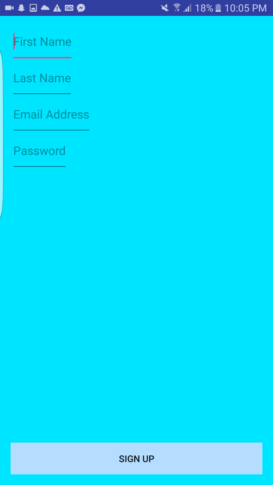
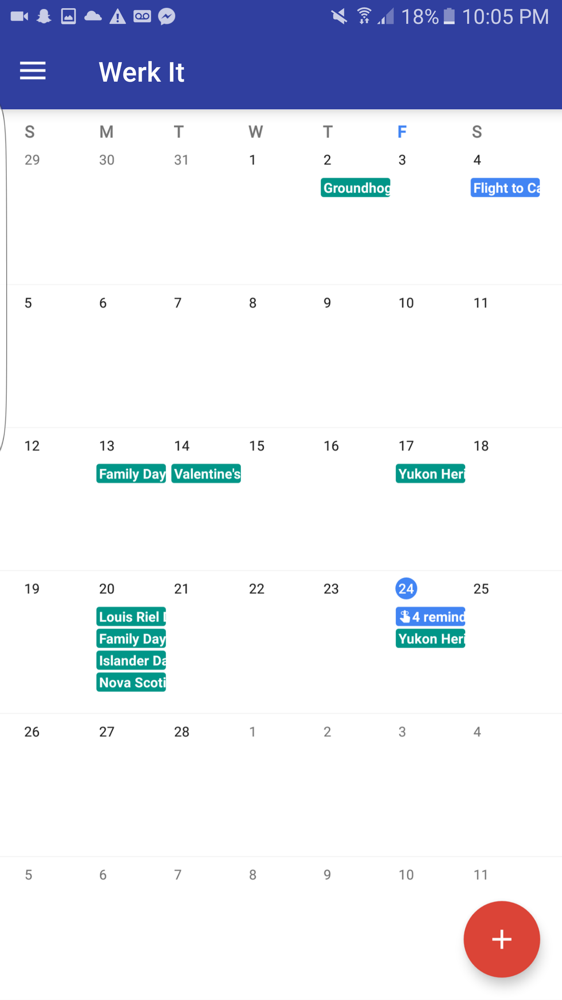
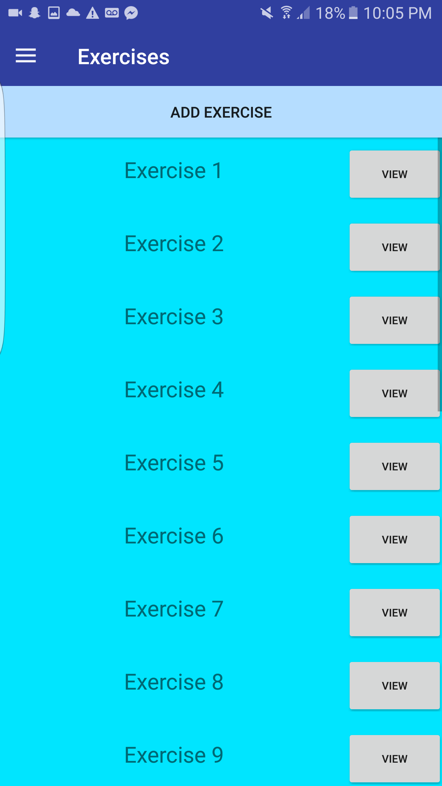
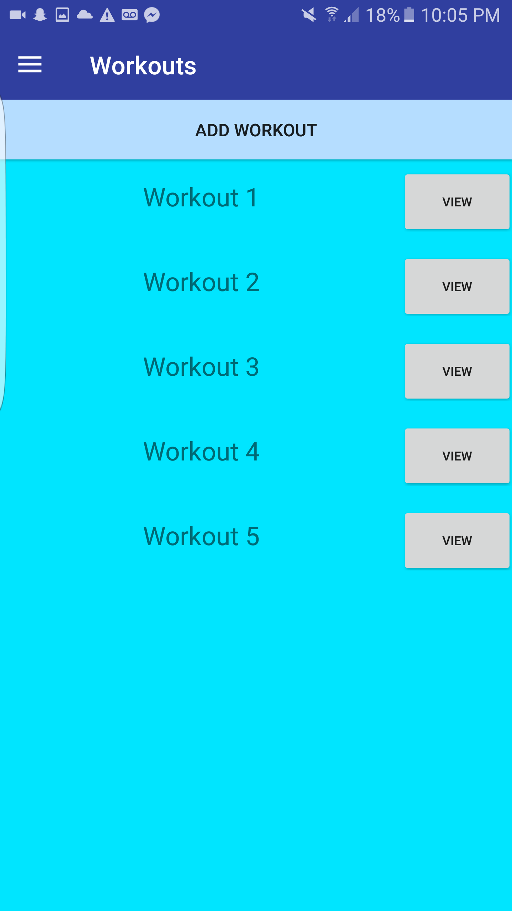
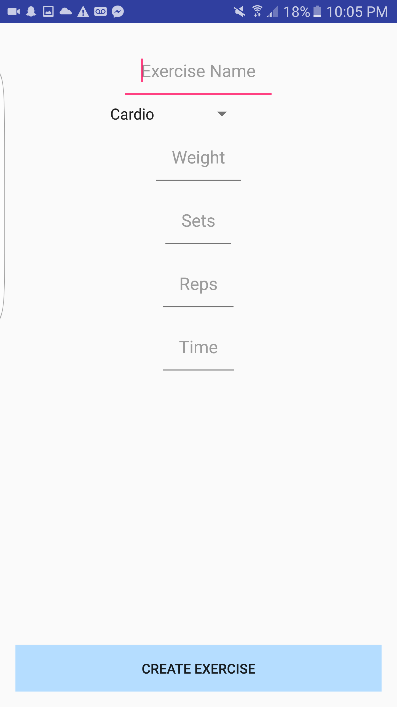

# WerkIt - A Fitness Tracker for Android

## About

Werk it is a Fitness Tracker application for Android. Initially developed for my grade 12 IB CS project, Werk It is my second attempt in Android development. 

## How does it work?

Users sign up through e-mail, or log in through Google+/Facebook. From there, they can create new exercises, and those exercises can be combined to create new workouts. From there, users can schedule fitness sessions and be notified of upcoming sessions with push notifications. Google Calendar API integration also allows for scheduled sessions to be updated in the user's calendar. 

## Features

- Object Oriented Design (exercises, workouts, sessions, etc.)
- User Authentication through the Firebase API
- Storage of user data through Firebase API
- User can set custom workouts
- Push notifications and Google Calendar integration

## Future Considerations

- UI/UX cleanup
- Running distance tracker feature
- Calorie watcher feature (or maybe a seperate app?)

## Screenshots

Splash 

Login 

Register 

Main 

Exercises 

Workouts 

Create New Exercise 

